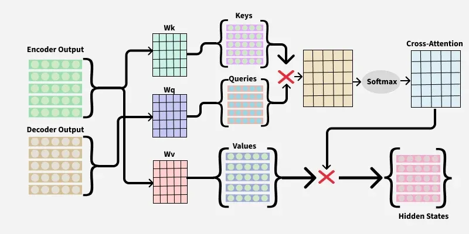

# Transformer中的交叉注意力机制

## [English version](./cross_attention_en.md) | [简体中文](./cross_attention.md)
## 简介

交叉注意力机制是Transformer模型的关键部分。它允许解码器访问和使用编码器的相关信息。这有助于模型关注重要细节，确保像翻译这样的任务准确无误。

*想象一下从详细描述（编码器）为图像生成说明文字（解码器）。交叉注意力帮助说明文字生成器关注关键细节，确保说明文字的准确性。*

交叉注意力使模型的不同部分能够交流并共享有用信息，以获得更好的结果。

## 交叉注意力如何工作？

让我们用一个简单的类比来解释这个过程：

1. **编码器（英文故事）**：编码器读取英文故事并将其分解为更小的块，如句子或单词。然后，每个块被转换为捕捉其含义的"表示"。

2. **解码器（中文翻译）**：解码器的工作是一次一个词地创建中文翻译。在生成每个词时，它需要知道英文故事中哪部分对当前翻译最重要。

3. **交叉注意力（助手）**：交叉注意力充当编码器和解码器之间的桥梁。它允许解码器"询问"编码器，英文故事中哪些部分与翻译当前词最相关，确保翻译准确有意义。

*在上图中，第一个红色交叉代表查询和键的点积，第二个红色交叉代表交叉注意力和值的点积。*

## 逐步过程

1. **查询（问题）**：解码器为它试图翻译的每个词创建一个"查询"。这个查询就像是在问："我应该关注英文故事的哪一部分？"

2. **键和值（答案）**：编码器提供"键"和"值"。键就像标签，帮助识别故事中重要的部分，而值则是这些部分的实际内容。

3. **匹配（找到最佳匹配）**：交叉注意力机制比较解码器的查询与编码器的键。它计算每个查询与每个键的匹配程度。这就像在问题和答案之间找到最佳匹配。

4. **组合信息（将所有内容放在一起）**：一旦找到最佳匹配，交叉注意力机制就会组合编码器中的相关信息（值）来帮助解码器生成翻译中的下一个词。

## 交叉注意力机制的数学表达式

交叉注意力的公式与自注意力非常相似，不同之处在于查询（Q）来自解码器的输出，而键（K）和值（V）来自编码器的输出。

Attention(Q, K, V) = softmax(QK^T/√d_k) V

这里，d_k是键的维度。

## 交叉注意力的复杂度

交叉注意力可能变得相当复杂，它主要取决于输入的长度和模型的注意力头数。它主要做的事情是计算点积并使用softmax函数来确定注意力权重。对于交叉注意力，复杂度通常如下：

### 时间复杂度

交叉注意力大约需要O(n² · d)时间。

- n是输入序列的长度（例如句子中的单词数）。
- d是向量的大小（例如每个单词嵌入的大小）。

n²部分来自于将每个单词与其他每个单词进行比较，这会形成一个大的n×n矩阵。

### 空间复杂度

交叉注意力需要约O(n²)空间。这是因为它必须存储注意力矩阵，其大小为n×n。

随着序列变长，复杂度快速增长，使Transformer模型使用大量计算能力。但是，诸如稀疏注意力和高效transformer等新想法正在帮助减少这个问题。

## 为什么交叉注意力很重要？

交叉注意力帮助解码器专注于编码器中最重要的信息。无论你是在翻译句子、创作小说还是描述图像，这都使整个过程更加准确和高效。

在机器翻译等任务中，交叉注意力帮助系统将源语言的单词与目标语言中最相关的单词对齐。这种对齐对于创建准确自然的翻译至关重要。

*例如，当将"I like eating ice cream"翻译成另一种语言时，交叉注意力帮助系统理解"ice cream"很重要，应该正确翻译。*

## 交叉注意力与自注意力的比较

| 方面 | 交叉注意力 | 自注意力 |
|-----|----------|---------|
| **定义** | 允许解码器使用来自编码器的信息。 | 允许序列中的每个单词关注同一序列中的其他单词。 |
| **用途** | 用于翻译等任务，模型在生成输出时必须查看整个输入（编码器）。 | 用于理解单个输入（如文本）内的关系，无需外部上下文。 |
| **焦点** | 专注于从模型的另一部分获取有用信息。 | 专注于同一句子中的单词如何相互关联。 |
| **数据流** | 涉及两个不同数据部分（编码器和解码器）之间的交互。 | 数据在同一序列内流动（内部注意力）。 |
| **示例** | 在翻译中，交叉注意力帮助解码器从编码器中选择正确的单词。 | 在文本分析中，自注意力帮助模型理解句子中的单词如何连接。 |

## 交叉注意力的应用

1. **语音识别**：交叉注意力将音频声音与正确的单词匹配，通过关注关键音频部分确保准确有意义的转录。

2. **问答系统**：交叉注意力帮助模型同时关注问题和文本，找到最相关的部分以提取正确答案。

3. **文本摘要**：当我们想要缩短一段长文本时，交叉注意力帮助模型确定原始文本中哪些部分最重要。它有助于创建捕捉主要思想的摘要。

4. **多模态模型**：Transformer中的交叉注意力机制不仅增强了当前模型能力，还为可解释性、适应性和可扩展性的未来进步开辟了道路，使与外部知识库和其他系统的更丰富交互成为可能。
